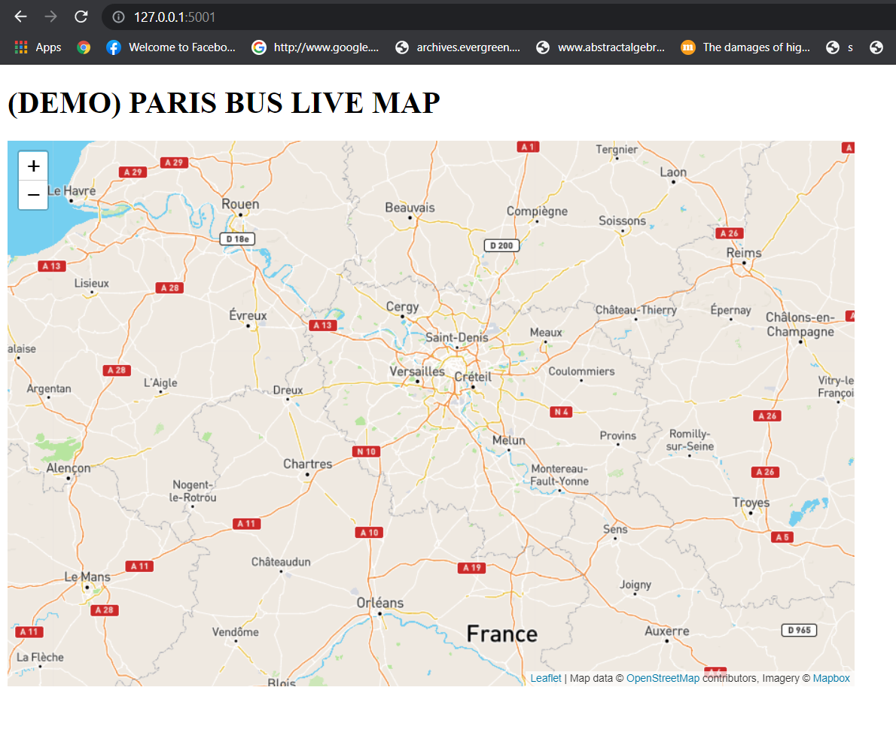

# Demo-Paris-Bus-Network-Application

* Used Kafka for live streaming and processing the data.
* Pykafka library to work with the Kafka client in Python.
* Python Flask as webserver and for API setup
* Javascript Leaflet.JS for visualization of the real-time map
